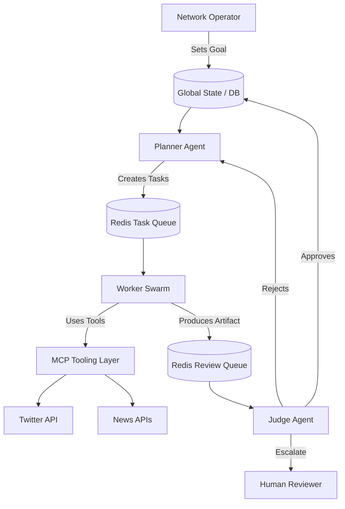

# Domain Architecture Strategy: Project Chimera

## 1. Agent Pattern: Hierarchical Swarm (The FastRender Pattern)

We will adopt the **Hierarchical Swarm** pattern as described in the SRS (Section 3.1). This rejects the "Monolithic Agent" in favor of specialized roles.

### Roles

- **Planner (The Strategist):**
    - _Responsibility:_ Maintains broad context (Campaign Goals). Decomposes high-level instructions into atomic tasks.
    - _Type:_ Value-based decision maker.
    - _Model:_ High-reasoning (Gemini 3 Pro / Claude Opus).
- **Worker (The Executor):**
    - _Responsibility:_ Stateless execution of atomic tasks. Uses Tools.
    - _Type:_ Action-oriented.
    - _Model:_ High-speed/Low-cost (Gemini Flash).
- **Judge (The Gatekeeper):**
    - _Responsibility:_ Quality Control & Safety. Reviews Worker output before commit.
    - _Role:_ Implements "Optimistic Concurrency Control" (OCC) and Safety Checks.
    - _Model:_ High-reasoning (Gemini 3 Pro).

### Architecture Diagram (Mermaid)

## 2. Human-in-the-Loop (HITL) Strategy

Safety is paramount. The HITL layer acts as a "Circuit Breaker".

### Governance Policy

- **High Confidence (> 0.9):** Auto-Approve.
- **Medium Confidence (0.7 - 0.9):** Async Review Queue. Agent moves on, but action is pending.
- **Low Confidence (< 0.7) OR Sensitive Topic:** Hard Reject or Mandatory Review.

### Implementation

- **Interface:** A lightweight "Inbox" view in the Orchestrator Dashboard.
- **Mechanism:** The Judge pushes a `ReviewRequest` to the database with a `status: pending_human`.

## 3. Database Strategy

A hybrid approach is required to handle the distinct data types (Velocity vs. Complexity).

| Data Type                   | Technology         | Rationale                                                                      |
| :-------------------------- | :----------------- | :----------------------------------------------------------------------------- |
| **Agent Memory (Semantic)** | **Weaviate**       | Vector search required for RAG (Long-term memory, Persona recall). MCP-native. |
| **Transactional Data**      | **PostgreSQL**     | Strict schema needed for User Accounts, Campaigns, and Financial Ledgers.      |
| **Queues & Cache**          | **Redis**          | High-velocity task queues (`TaskQueue`, `ReviewQueue`) and ephemeral state.    |
| **Logs (Flight Recorder)**  | **Tenx MCP Sense** | Specialized tracing for agent reasoning chains.                                |
